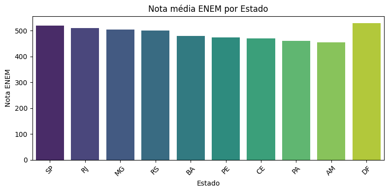
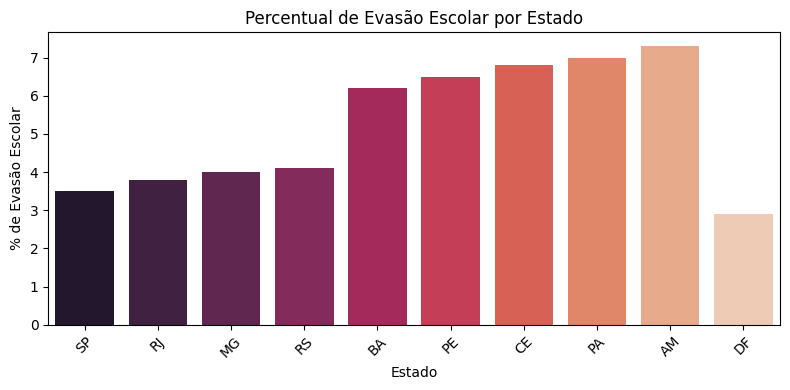
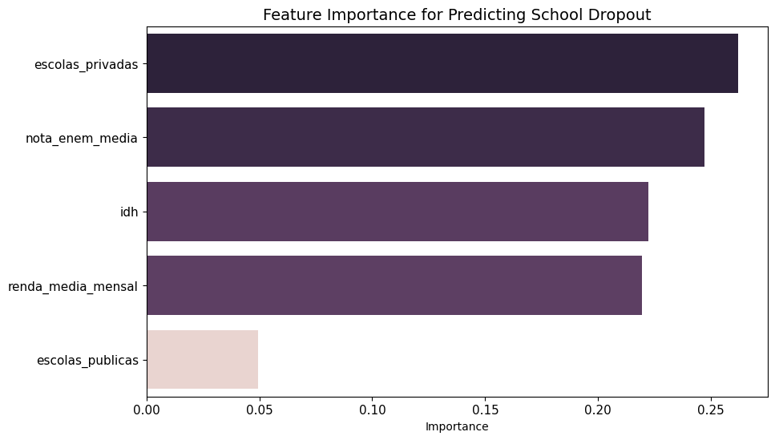

# Evasão Escolar e Desempenho Educacional no Brasil
*Explorando como desempenho acadêmico, indicadores de desenvolvimento e distribuição de recursos educacionais se relacionam com padrões de evasão escolar.*

**Dataset:** Indicadores educacionais simulados de 10 estados brasileiros  
**Técnicas:** EDA, análise de correlação, modelos de regressão, feature importance  
**Ferramentas:** Python, Pandas, Seaborn, Scikit-learn  

**Objetivo:** Explorar quais fatores estão mais associados à evasão escolar e ao desempenho educacional, demonstrando como análises de dados podem apoiar melhores decisões.

## Contexto do Projeto

Neste projeto explorei como diferentes indicadores educacionais e socioeconômicos se relacionam com padrões de evasão escolar entre estados brasileiros.

A evasão escolar é um indicador importante porque reflete tanto o desempenho educacional quanto condições mais amplas do sistema. Diferenças em desenvolvimento socioeconômico, acesso a recursos educacionais e desempenho acadêmico podem influenciar diretamente a permanência dos estudantes na escola.

A análise utiliza variáveis como:

- `nota_enem_media`
- `renda_media_mensal`
- `idh`
- `escolas_publicas`
- `escolas_privadas`
- `evasao_escolar_percent`

Mesmo sendo um dataset pequeno e simplificado, o objetivo do projeto é demonstrar um **processo analítico estruturado**, desde exploração de dados até geração de insights que podem ajudar a entender melhor padrões educacionais.

## Dataset

O dataset contém indicadores educacionais e socioeconômicos de **10 estados brasileiros**.

Principais variáveis utilizadas:

- `nota_enem_media`: média da nota do ENEM
- `renda_media_mensal`: renda média mensal
- `idh`: índice de desenvolvimento humano
- `escolas_publicas`: número de escolas públicas
- `escolas_privadas`: número de escolas privadas
- `evasao_escolar_percent`: percentual de evasão escolar

Essas variáveis permitem explorar como **desempenho educacional, desenvolvimento socioeconômico e disponibilidade de recursos educacionais** podem se relacionar com padrões de evasão escolar.

## Ferramentas e Habilidades Demonstradas

Este projeto demonstra habilidades importantes para funções de **Analytics, Business Intelligence e Data Science**, incluindo:

**Ferramentas**

- Python
- Pandas
- Seaborn
- Matplotlib
- Scikit-learn

**Técnicas de análise**

- Análise exploratória de dados (**EDA**)
- Visualização de dados
- Análise de correlação
- Modelos de regressão
- Decision Tree
- Random Forest e análise de **feature importance**
- Interpretação de resultados e geração de insights

Além das ferramentas técnicas, o projeto demonstra **capacidade de transformar dados em insights interpretáveis**, algo essencial em projetos de analytics.

## Análise Exploratória

A primeira etapa da análise consistiu em explorar como os principais indicadores variam entre os estados.

**Figura:** Nota média do ENEM por estado.

A nota média do ENEM (`nota_enem_media`) varia de **455 a 530**, mostrando diferenças relevantes de desempenho educacional entre os estados.

Estados com melhores indicadores socioeconômicos tendem a apresentar médias mais altas.

**Figura:** Percentual de evasão escolar por estado.

A variável `evasao_escolar_percent` varia entre **2.9% e 7.3%**, indicando diferenças importantes nos padrões de permanência escolar.

## Análise de Correlação

A matriz de correlação foi utilizada para explorar relações entre as variáveis do dataset.

De forma geral, a análise sugere que:

- `idh` tende a aparecer associado a **menores taxas de evasão**
- `renda_media_mensal` aparece associado a **melhor desempenho acadêmico**
- indicadores de desenvolvimento e desempenho educacional parecem estar relacionados

Essa etapa ajuda a identificar **quais variáveis podem ter maior relevância na análise posterior**.

## Comparação entre Estados

Para ilustrar melhor os padrões encontrados, foi realizada uma comparação entre o estado com maior renda média e o estado com menor renda média.

**Distrito Federal**

- `renda_media_mensal`: **3500**
- `nota_enem_media`: **530**
- `evasao_escolar_percent`: **2.9**

**Amazonas**

- `renda_media_mensal`: **1450**
- `nota_enem_media`: **455**
- `evasao_escolar_percent`: **7.3**

A diferença entre os dois casos mostra como **indicadores de desenvolvimento e desempenho educacional podem aparecer acompanhados por diferenças nas taxas de evasão**.

## Modelagem Preditiva

Para complementar a análise exploratória, foram utilizados modelos simples de regressão para estimar `evasao_escolar_percent`.

Modelos utilizados:

- Linear Regression
- Decision Tree Regressor

O objetivo desta etapa não foi criar um modelo preditivo final, mas demonstrar como **modelos estatísticos podem ajudar a identificar padrões e relações nos dados**.

## Importância das Variáveis

Foi utilizado um modelo **Random Forest** para estimar a importância relativa das variáveis na previsão da evasão escolar.

**Figura:** Importância das variáveis para prever evasão escolar.

Resultado da análise de feature importance:

- `escolas_privadas`: **0.262**
- `nota_enem_media`: **0.247**
- `idh`: **0.222**
- `renda_media_mensal`: **0.219**
- `escolas_publicas`: **0.049**

O resultado sugere que padrões de evasão escolar podem estar associados a uma combinação de **desempenho acadêmico, desenvolvimento socioeconômico e disponibilidade de recursos educacionais**.

## Principais Insights

Mesmo com um dataset simplificado, alguns padrões aparecem de forma consistente ao longo da análise.

- `nota_enem_media` varia de **455 a 530**, indicando diferenças relevantes de desempenho educacional
- `evasao_escolar_percent` varia entre **2.9% e 7.3%**
- estados com maior `idh` e maior `renda_media_mensal` tendem a apresentar melhores resultados educacionais
- a comparação entre Distrito Federal e Amazonas ilustra diferenças importantes em desempenho e evasão
- a análise de feature importance mostra que `escolas_privadas`, `nota_enem_media`, `idh` e `renda_media_mensal` têm maior relevância na previsão de evasão

Esses resultados sugerem que a evasão escolar não está associada a um único fator, mas sim a uma combinação de **desempenho educacional, desenvolvimento e distribuição de recursos**.

## Governança de Dados

Mesmo em projetos exploratórios, é importante considerar princípios de **governança de dados**.

Em análises educacionais reais, alguns pontos importantes incluem:

- qualidade e confiabilidade dos dados
- transparência na metodologia utilizada
- interpretação responsável dos resultados
- documentação clara das variáveis e fontes

Esses cuidados ajudam a garantir que análises de dados possam ser utilizadas de forma confiável em contextos de decisão.

## Limitações

Algumas limitações do projeto incluem:

- dataset pequeno e simplificado
- dados agregados por estado
- ausência de outras variáveis potencialmente relevantes

Por esse motivo, os resultados devem ser interpretados como **exploração analítica**, e não como conclusões definitivas.

## Possíveis Extensões

Este projeto pode ser expandido de diversas formas:

- utilização de datasets educacionais reais
- análise com séries temporais
- inclusão de mais indicadores educacionais
- criação de dashboards interativos para visualização dos dados

